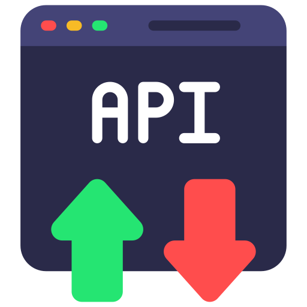

# Diltru - Is it truly a good deal?

**An ecommerce site price tracker and alert app, like [Keepa](https://keepa.com/) or [CamelCamelCamel](https://camelcamelcamel.com/), where a user can check price history and get alerts on price drops of select products on a given Kenyan ecommerce site. The app initially focuses on [Jumia Kenya](https://www.jumia.co.ke/) ecommerce site.**

Built with **Django** and **Django REST Framework**, it features a robust scraping engine, a full REST API, and an interactive dashboard.
##  Features

| Feature       | Capabilities                                         | Tech Stack                   |
| :------------ | :--------------------------------------------------- | :--------------------------- |
| **Dashboard** | Manage alerts, filter/sort/search, CRUD              | Bootstrap 5, JS, Fetch API   |
| **Tracker**   | Auto-scrapes Price, SKU, Images & visualizes history | BS4, Requests, Chart.js      |
| **API**       | RESTful endpoints, Swagger Docs, Secure Auth         | Django 5, DRF, Token/Session |
| **Alerts**    | Email notifications on price drops                   | Django Mail, Custom Commands |
##  Installation and Setup

1.  **Clone the repository**
```bash
git clone https://github.com/gurthii/diltru_app.git
cd diltru
```

2.  **Create a Virtual Environment**
```bash
python -m venv .venv
source .venv/bin/activate  # On Windows: .venv\Scripts\activate
```

3.  **Install Dependencies**
```bash
pip install -r requirements.txt
```

4.  **Configure Environment Variables**
```ini
# Create a `.env` file in the root directory:
DEBUG=True
SECRET_KEY=your-secret-key-here
EMAIL_USER=your-email@gmail.com
EMAIL_PASSWORD=your-app-password
```

5.  **Run Migrations**
```bash
python manage.py makemigrations
python manage.py migrate
```

6.  **Start the Server**
```bash
python manage.py runserver
```
- Visit **[http://127.0.0.1:8000/](http://127.0.0.1:8000/)** to access the app.
- Visit **[http://127.0.0.1:8000/api/docs/](http://127.0.0.1:8000/api/docs/)** to access API documentation, done by Swagger UI.
##  Key API Endpoints

All API requests (except for Registration and Login) must include the following header:
`Authorization: Token <your_token_here>`

| Category     | Method   | Endpoint                      | Description                                                |
| :----------- | :------- | :---------------------------- | :--------------------------------------------------------- |
| **Auth**     | `POST`   | `/api/auth/register/`         | Create a new user account                                  |
| **Auth**     | `POST`   | `/api/auth/login/`            | Obtain an authentication token                             |
| **User**     | `GET`    | `/api/users/me/`              | Retrieve current user profile details                      |
| **Alerts**   | `GET`    | `/api/alerts/`                | List alerts (Supports Search, Status Filter, and Ordering) |
| **Alerts**   | `POST`   | `/api/alerts/`                | Track a new Jumia URL (Auto-scrapes product data)          |
| **Alerts**   | `PATCH`  | `/api/alerts/{id}/`           | Update the target price for a specific tracker             |
| **Alerts**   | `DELETE` | `/api/alerts/{id}/`           | Delete an alert and stop tracking the product              |
| **Insights** | `GET`    | `/api/products/{id}/history/` | Fetch price data points for Chart.js visualization         |
| **Docs**     | `GET`    | `/api/docs/`                  | Interactive Swagger/OpenAPI documentation                  |

**Search & Filtering Examples**  
For instance, the `/api/alerts/` endpoint is highly flexible. You can combine parameters to find exactly what you need:

```text
GET /api/alerts/?search=samsung
GET /api/alerts/?status=TRIGGERED
GET /api/alerts/?ordering=target_price
GET /api/alerts/?search=tv&status=ACTIVE&ordering=-created_at
```

**Getting Started with the API**
Once your server is running, follow these steps to test the core functionality:
- Register a new user via API
```bash
# POST /api/auth/register/
{ "username": "dev_user", "password": "password123", "email": "dev@example.com" }
```

- Login to get your Token
```bash
# POST /api/auth/login/
{ "username": "dev_user", "password": "password123" }
```
- Start tracking a product, the backend will automatically scrape the product details
```bash
# POST /api/alerts/
# Header: Authorization: Token <your_token>
{
    "jumia_url": "https://www.jumia.co.ke/nivea-men-deep-body-lotion-for-men-400ml-pack-of-2-68528016.html",
    "target_price": 12000.00
}
```


7. **Running the Scraper**
```bash
# To upddate prices manually (or set up as a Cron Job)
python manage.py update_prices
```

##  License & Disclaimer

This project is designed for educational purposes as a Capstone Project submission.

If you have any questions or concerns, please contact me via my portfolio [here](https://gurthii.github.io/).

\*\*Feature icons created by Freepik - [Flaticon](https://www.flaticon.com/free-icons/feature).